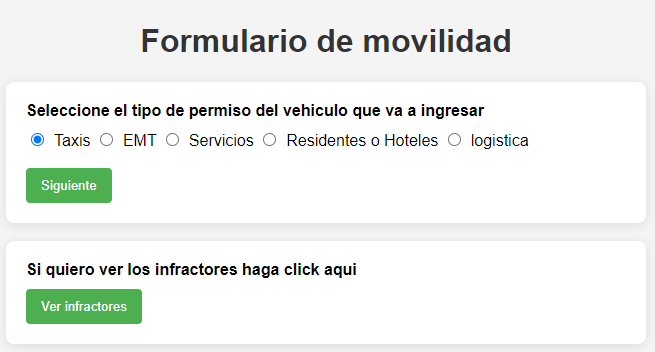

# Formulario de Movilidad

Este proyecto consiste en una aplicación web que permite gestionar permisos de vehículos para diferentes tipos de usuarios, así como identificar vehículos infractores. Incluye validaciones, almacenamiento en archivos de texto y generación dinámica de formularios basados en las selecciones del usuario.

  

## Características

- Gestión de permisos de vehículos según tipo:
  - **Taxis**
  - **EMT (Empresa Municipal de Transportes)**
  - **Servicios**
  - **Residentes y Hoteles**
  - **Logística**
- Validación de entradas en formularios.
- Almacenamiento de datos en archivos `.txt`.
- Identificación de vehículos infractores comparando matrículas con permisos almacenados.
- Interfaz sencilla y amigable.

## Requisitos

- **PHP**: El proyecto utiliza PHP para procesar formularios y manejar archivos.
- **Servidor web**: Se recomienda usar [XAMPP](https://www.apachefriends.org/) o [WAMP](https://www.wampserver.com/) para pruebas locales.
- **Archivos necesarios**:
  - `datos/taxis.txt`
  - `datos/vehiculosEMT.txt`
  - `datos/servicios.txt`
  - `datos/residentesYHoteles.txt`
  - `datos/logistica.txt`
  - `datos/vehiculos.txt` (para los vehículos infractores)

## Instalación

1. Descarga el proyecto en tu servidor local.
2. Asegúrate de que la carpeta `datos/` tiene permisos de lectura y escritura.
3. Coloca los archivos de texto necesarios en la carpeta `datos/`.
4. Accede a `index.html` desde tu navegador usando la URL del servidor local (por ejemplo, `http://localhost/proyecto`).

## Validaciones Incluidas

- Verificación de campos obligatorios: matrícula, datos adicionales según el tipo de permiso.
- Comprobación de duplicados: no se permiten matrículas repetidas.
- Validación de fechas para residentes y hoteles: la fecha de inicio debe ser menor que la de fin.

---

Desarrollado por Samuel Moniz Pereira. 

## Licencia

Este proyecto está bajo la [Licencia MIT](https://opensource.org/licenses/MIT). Puedes usar, copiar, modificar y distribuir el software bajo las condiciones de esta licencia. Para más detalles, consulta el archivo [LICENSE](LICENSE) en la raíz del proyecto.

### Resumen de la Licencia MIT
La Licencia MIT es una de las licencias de software más permisivas y ampliamente utilizadas. Permite a los usuarios hacer casi cualquier cosa con tu proyecto, siempre que incluyan la misma licencia en cualquier copia o modificación del software. Esto incluye:

- Usar el software para cualquier propósito.
- Hacer copias del software.
- Modificar el software y distribuir versiones modificadas.
- Incluir el software en proyectos comerciales.

### Limitación de Responsabilidad
Este software se proporciona "tal cual", sin garantía de ningún tipo, expresa o implícita, incluyendo, pero no limitado a, las garantías de comerciabilidad, adecuación para un propósito particular y no infracción. En ningún caso los autores o titulares de derechos de autor serán responsables de ninguna reclamación, daño u otra responsabilidad, ya sea en una acción de contrato, agravio o de otro tipo, que surja de o en conexión con el software o el uso u otros tratos en el software.
